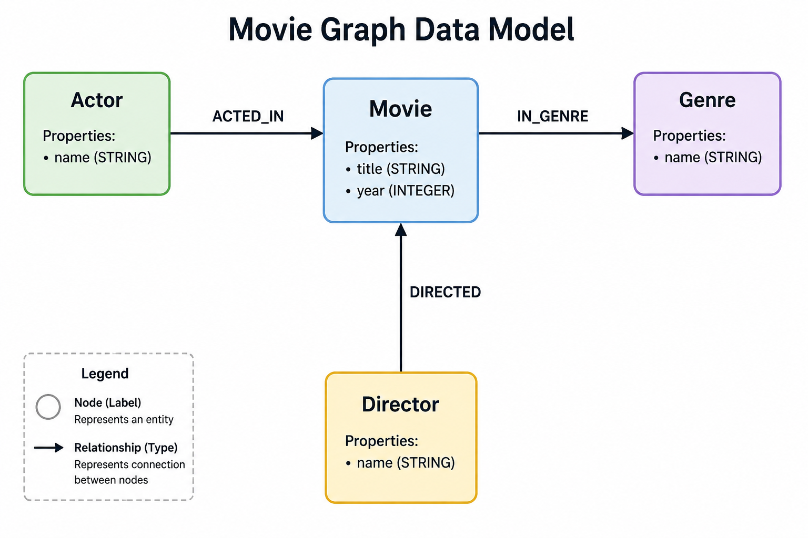
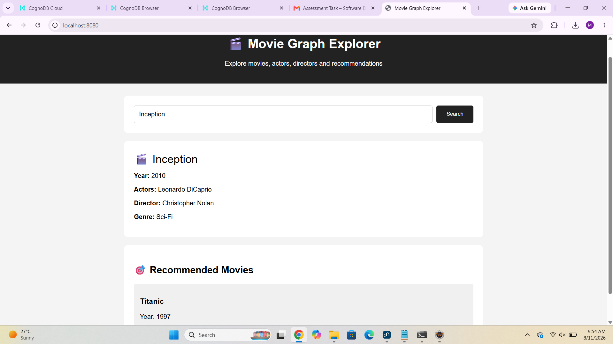
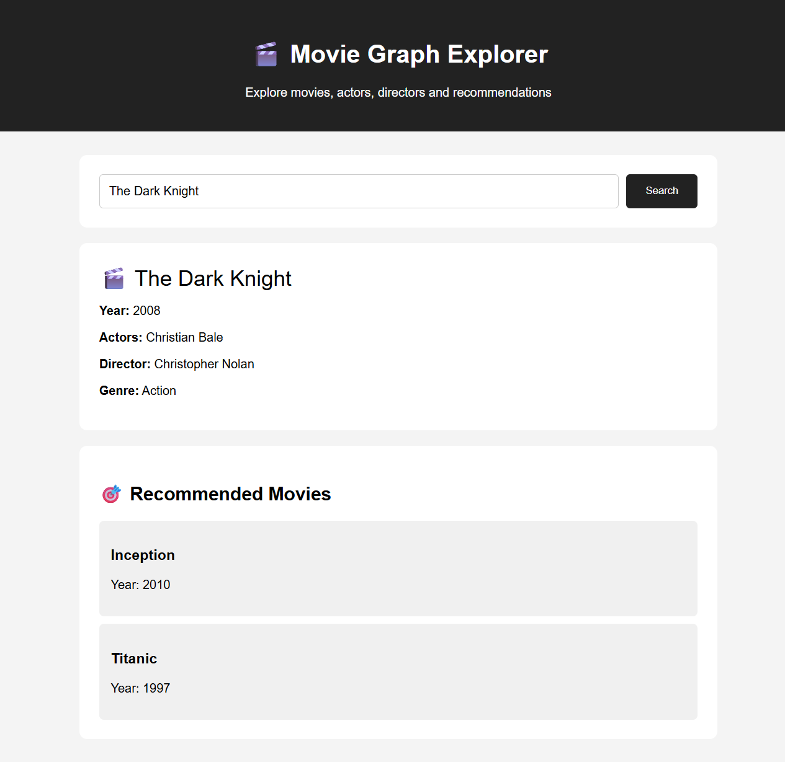

# Movie Graph Explorer

A Spring Boot web application backed by CognoDB, a graph database.

Movie Graph Explorer allows users to search for movies and explore connected actors, directors, genres, and recommended movies through graph relationships.

## Project Overview

Movie information is naturally connected.

For example:

- Actors act in movies.
- Directors direct movies.
- Movies belong to genres.
- Actors can connect one movie to another movie through shared acting relationships.

This project represents these connections using a graph database and provides a Spring Boot application for querying the graph.

The application uses CognoDB for graph storage and Cypher queries for graph traversal.

## Objectives

The main objectives of this project are:

- Build a movie graph using CognoDB.
- Store movies, actors, directors, and genres as graph nodes.
- Create relationships between connected entities.
- Query the graph using Cypher.
- Connect a Spring Boot application to CognoDB.
- Search movies by title.
- Display connected actors, directors, and genres.
- Demonstrate a multi-hop movie recommendation query.
- Provide documentation, screenshots, and example queries.

## Graph Data Model

The application uses four main node types:

- Movie
- Actor
- Director
- Genre

The main relationships are:

```text
Actor ── ACTED_IN ──> Movie
Director ── DIRECTED ──> Movie
Movie ── IN_GENRE ──> Genre

The graph model diagram is stored in:

docs/graph-model.png

The graph model represents the relationships between movies, actors, directors, and genres.

Leonardo DiCaprio ── ACTED_IN ──> Inception

Christopher Nolan ── DIRECTED ──> Inception

Inception ── IN_GENRE ──> Sci-Fi

## Sample Graph Data

The project contains the following sample movie data.

### Movies

| Movie | Year |
|---|---:|
| Inception | 2010 |
| Titanic | 1997 |
| The Dark Knight | 2008 |

### Actors

- Leonardo DiCaprio
- Christian Bale

### Director

- Christopher Nolan

### Genres

- Sci-Fi
- Action

### Relationships

```text
Leonardo DiCaprio ── ACTED_IN ──> Inception
Leonardo DiCaprio ── ACTED_IN ──> Titanic

Christian Bale ── ACTED_IN ──> The Dark Knight

Christopher Nolan ── DIRECTED ──> Inception
Christopher Nolan ── DIRECTED ──> The Dark Knight

Inception ── IN_GENRE ──> Sci-Fi
The Dark Knight ── IN_GENRE ──> Action

The seed data is stored in:

scripts/seed.cypher


## Cypher Queries

The project's Cypher queries are stored in:

`queries/movie-queries.cypher`

### 1. Find a Movie by Title

```cypher
MATCH (m:Movie {title: $title})
RETURN m.title AS title, m.year AS year;
```

This query searches for a movie by its title and returns the movie title and year.

### 2. Find Actors in a Movie

```cypher
MATCH (a:Actor)-[:ACTED_IN]->(m:Movie {title: $title})
RETURN a.name AS actor, m.title AS movie;
```

This query finds the actors who acted in the selected movie.

### 3. Find the Director of a Movie

```cypher
MATCH (d:Director)-[:DIRECTED]->(m:Movie {title: $title})
RETURN d.name AS director, m.title AS movie;
```

This query finds the director of the selected movie.

### 4. Find the Genres of a Movie

```cypher
MATCH (m:Movie {title: $title})-[:IN_GENRE]->(g:Genre)
RETURN m.title AS movie, g.name AS genre;
```

This query finds the genres associated with the selected movie.

### 5. Multi-Hop Recommendation Query

```cypher
MATCH (m:Movie {title: $title})
MATCH (a:Actor)-[:ACTED_IN]->(m)
MATCH (a)-[:ACTED_IN]->(other:Movie)
WHERE other.title <> $title
RETURN DISTINCT other.title AS title, other.year AS year;
```

This query demonstrates a multi-hop graph traversal:

```text
Movie → Actor → Another Movie
```

For example:

```text
Inception
    ↓
Leonardo DiCaprio
    ↓
Titanic
```

The recommendation query returns another movie connected through an actor who acted in the original movie.

## Application

The application is implemented using Spring Boot.

The application provides two main endpoints:

```text
/search
/recommendations
```

The Spring Boot application communicates with CognoDB using the Neo4j Java Driver.

The application flow is:

```text
User
  ↓
Spring Boot Application
  ↓
MovieController
  ↓
Neo4j Java Driver
  ↓
CognoDB
  ↓
Cypher Query
  ↓
Query Result
  ↓
Application Response
```

### Movie Search

The `/search` endpoint searches for a movie by title and returns:

- Movie title
- Year
- Actors
- Directors
- Genres

Example:

```text
Inception
2010
Leonardo DiCaprio
Christopher Nolan
Sci-Fi
```

### Movie Recommendations

The `/recommendations` endpoint finds related movies through actor relationships.

For example:

```text
Inception
    ↓
Leonardo DiCaprio
    ↓
Titanic
```

This demonstrates the multi-hop graph traversal:

```text
Movie → Actor → Another Movie
```

## Setup and Run

### Prerequisites

The project requires:

- Java
- Maven
- Eclipse or another Java IDE
- CognoDB graph database
- Git

### 1. Configure CognoDB

Create a CognoDB database and obtain:

```text
COGNODB_URI
COGNODB_USERNAME
COGNODB_PASSWORD
```

### 2. Configure Environment Variables

Create a local `.env` file containing your actual CognoDB credentials:

```text
COGNODB_URI=bolt+s://your-cognodb-uri
COGNODB_USERNAME=your-username
COGNODB_PASSWORD=your-password
```

Do not commit the real `.env` file or database password to GitHub.

The project also contains:

```text
.env.example
```

The `.env.example` file should contain only placeholder values.

### 3. Configure Application Properties

The application uses the following properties:

```properties
cognodb.uri=${COGNODB_URI}
cognodb.username=${COGNODB_USERNAME}
cognodb.password=${COGNODB_PASSWORD}
```

### 4. Load Seed Data

The sample graph data is stored in:

```text
scripts/seed.cypher
```

The seed data creates:

- Movie nodes
- Actor nodes
- Director nodes
- Genre nodes
- ACTED_IN relationships
- DIRECTED relationships
- IN_GENRE relationships

### 5. Run the Application

Open the project in Eclipse and run:

```text
MovieGraphApplication.java
```

The Spring Boot application runs on:

```text
http://localhost:8080
```

### 6. Test Movie Search

For Inception:

```text
http://localhost:8080/search?title=Inception
```

For The Dark Knight:

```text
http://localhost:8080/search?title=The%20Dark%20Knight
```

### 7. Test Recommendations

For Inception:

```text
http://localhost:8080/recommendations?title=Inception
```

Expected recommendation:

```json
[
  {
    "title": "Titanic",
    "year": 1997
  }
]
```

## Project Structure

```text
movie-graph-app
│
├── docs
│   ├── graph-model.png
│   └── screenshots
│       ├── inception-search.png
│       └── dark-knight-search.png
│
├── queries
│   └── movie-queries.cypher
│
├── scripts
│   └── seed.cypher
│
├── src
│   └── main
│       ├── java
│       │   └── com.moviegraph.movie_graph_app
│       │       ├── MovieGraphApplication.java
│       │       ├── config
│       │       │   └── CognoDbConfig.java
│       │       └── controller
│       │           └── MovieController.java
│       │
│       └── resources
│           └── application.properties
│
├── .env.example
├── .gitignore
├── pom.xml
└── README.md
```

### Important Files

**MovieGraphApplication.java**  
Main Spring Boot application used to start the project.

**CognoDbConfig.java**  
Configures the CognoDB connection using environment variables.

**MovieController.java**  
Contains the movie search and recommendation endpoints.

**scripts/seed.cypher**  
Contains the sample movie graph data.

**queries/movie-queries.cypher**  
Contains the Cypher queries used by the project.

**docs/graph-model.png**  
Contains the graph model diagram.

**docs/screenshots/**  
Contains screenshots of the working application.

**.env.example**  
Contains example environment-variable configuration without real credentials.

**.gitignore**  
Prevents sensitive and unnecessary files from being committed.

**pom.xml**  
Contains the Maven project configuration and dependencies.


## Screenshots

The project includes screenshots demonstrating the working application and graph model.

### Graph Model

The graph model shows the relationships between Movie, Actor, Director, and Genre nodes.



### Inception Search

The application successfully searches for Inception and displays its movie information.



Expected information:

```text
Title: Inception
Year: 2010
Actor: Leonardo DiCaprio
Director: Christopher Nolan
Genre: Sci-Fi
```

### The Dark Knight Search

The application successfully searches for The Dark Knight and displays its movie information.



Expected information:

```text
Title: The Dark Knight
Year: 2008
Actor: Christian Bale
Director: Christopher Nolan
Genre: Action
```

## Security

Database credentials must not be committed to the repository.

The application uses environment variables:

```text
COGNODB_URI
COGNODB_USERNAME
COGNODB_PASSWORD
```

The real `.env` file is excluded using `.gitignore`.

The `.env.example` file can be committed because it contains only placeholder values.

Never expose or commit the real CognoDB password.

---

## Assignment Deliverables

The project includes:

- Spring Boot application
- CognoDB graph database
- Movie graph model
- Movie, Actor, Director, and Genre nodes
- Graph relationships
- Seed data
- Cypher queries
- Movie search functionality
- Movie recommendation functionality
- Graph model diagram
- Application screenshots
- README documentation
- `.env.example`
- `.gitignore`

---

## Conclusion

The Movie Graph Explorer demonstrates how a graph database can be used to represent and query connected movie information.

The project uses Spring Boot as the application framework and CognoDB as the graph database.

Cypher queries are used to search movies, find actors, find directors, find genres, and traverse relationships between connected movies.

The multi-hop recommendation demonstrates:

```text
Movie → Actor → Another Movie
```

For example:

```text
Inception
    ↓
Leonardo DiCaprio
    ↓
Titanic
```

This project demonstrates the integration of Spring Boot, CognoDB, the Neo4j Java Driver, and Cypher for working with connected movie data.

---

## Author

**Manusha Vollem**

**Movie Graph Explorer — CognoDB Assignment 2**


## Why a Graph Database?

Movie information contains many relationships between connected entities such as movies, actors, directors, and genres.

A graph database is suitable for this application because relationships are stored directly between connected entities.

For example, the application can traverse:

```text
Movie → Actor → Another Movie
```

This allows the application to find recommended movies through shared actors using a multi-hop graph traversal.

In this project, CognoDB stores relationships such as:

- Actors acted in movies.
- Directors directed movies.
- Movies belong to genres.
- Actors connect one movie to another movie through shared acting relationships.

These relationship-based queries are easier to express using a graph database than by joining multiple relational database tables.